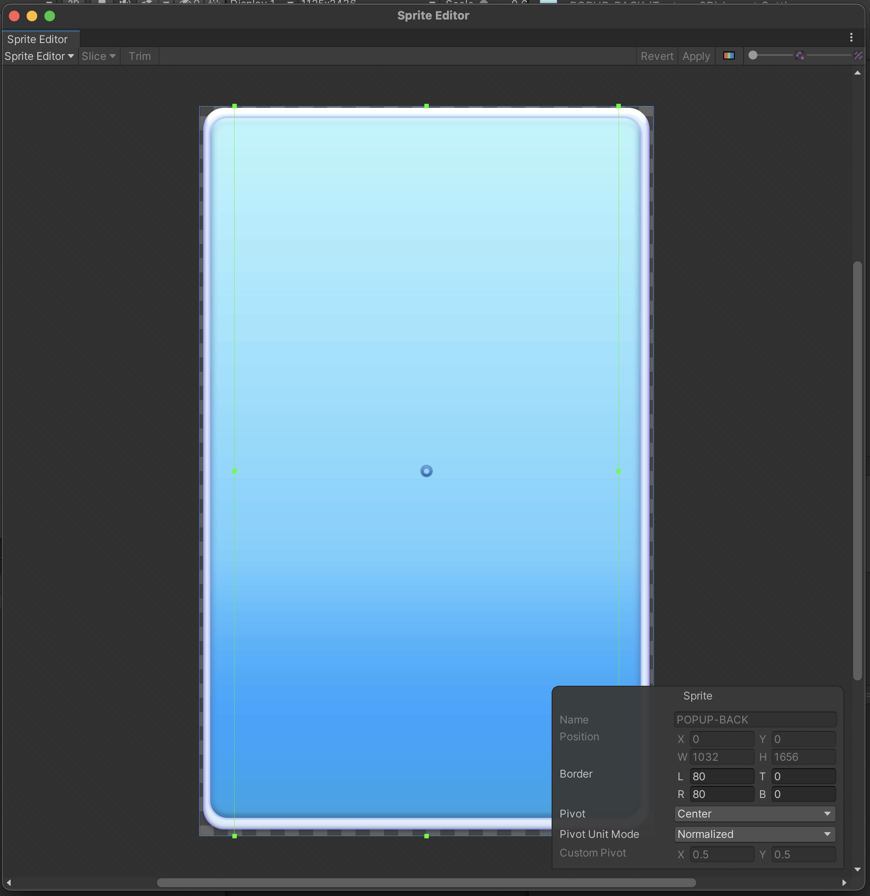
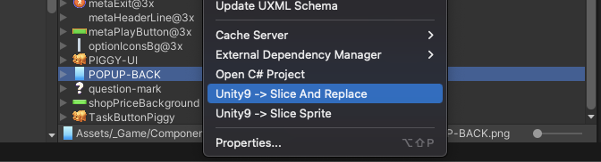
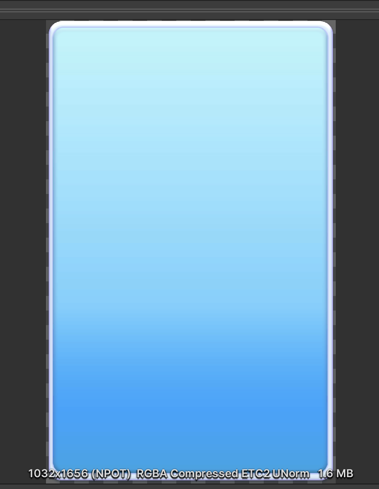
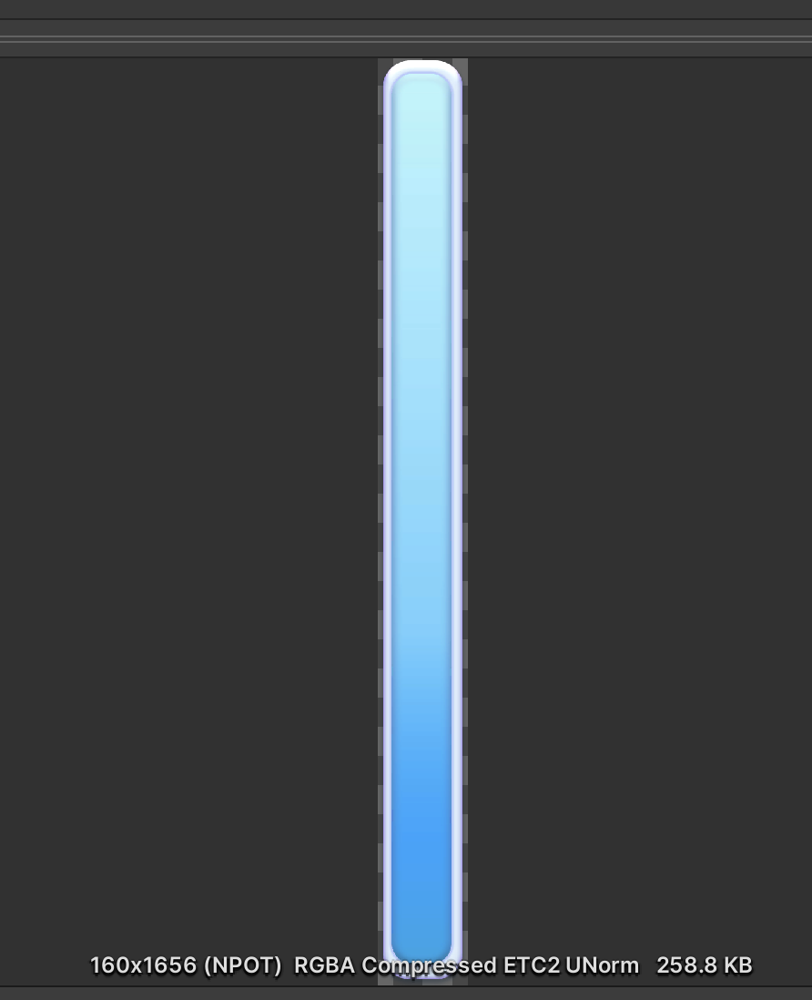

# Unity 9 Patch Slicing Based on Sprite Borders

## Information
Generates smaller sized png images and decreases app size and memory usage.

## Setup

### Import As Package

You can import packages using Unity Import Package.
You can find versions in Build folder
Note: Use Crunch Compression should be disabled for the source sprite.

## Description

Configure source image sprite borders first

Apply slice operation

Congrats !! Before And After

## Release Notes

CHANGELOG (see [CHANGELOG](CHANGELOG.MD))

## License

MIT License (see [LICENSE](LICENSE))

## See Also

* Original GitHub Page https://github.com/kyubuns/Auto9Slicer , https://github.com/pshutov/OnionRing-Unity
